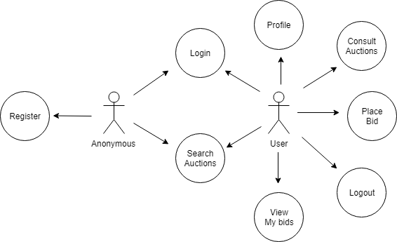
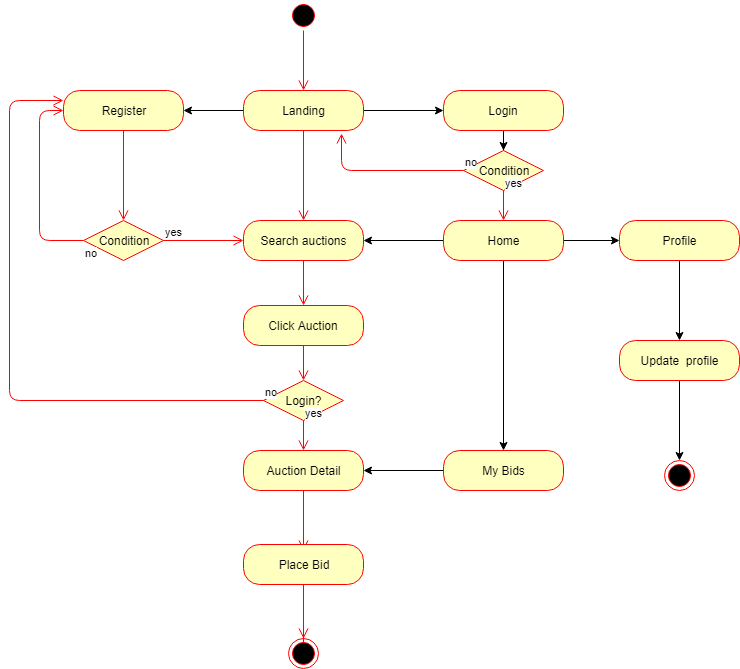
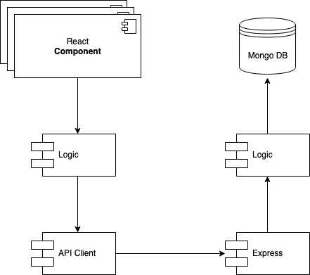
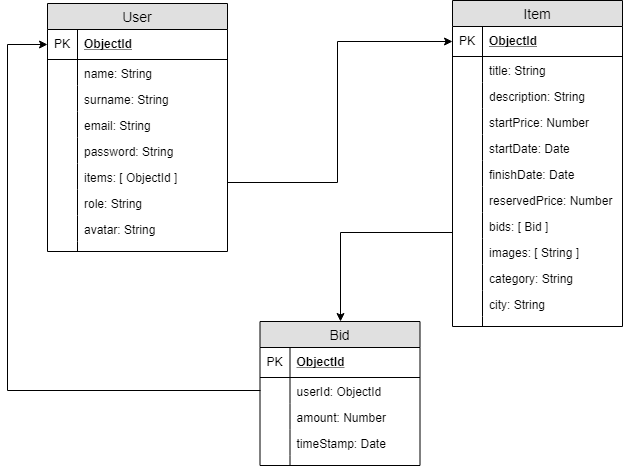
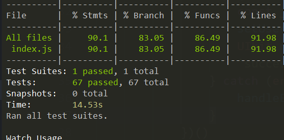
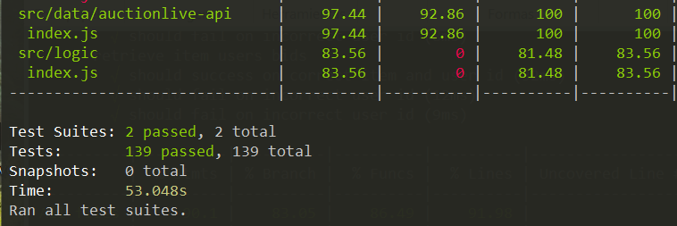

# DIAMOND AUCTIONS

### Introduction
This project emulate an auction house where you can search diferents items to bidding in real time.

## Functional Description

### Use Cases

### FlowChart

## Technical Description
### Blocks

### Components

### Data Model

### Coverage
#### API

#### APP

### Technologies
 Javascript, React (Hooks), Node.js, Express, Mongoose and MongoDB

## TODO (LA CAGUÉ)
- FIX query string
- FIX filters
- FIX show message errors

## NEXT FUNCTIONALITIES AND MORE!
- Add lots in same auction
- Add billing page and pay platform
- Add Socket IO
- Update styles

## PLANNING
[Trello](https://trello.com/b/ZmPaOXez/auction-live)