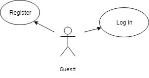
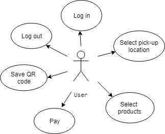
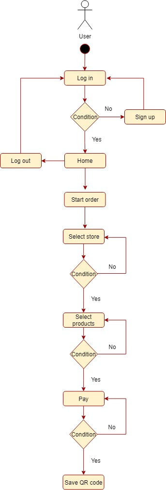
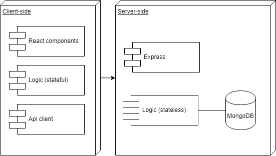
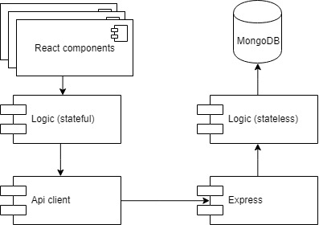
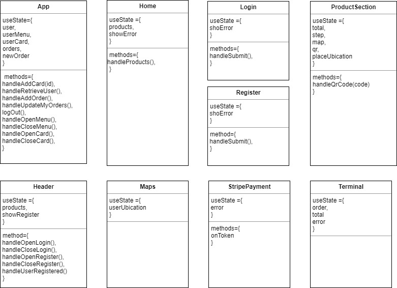
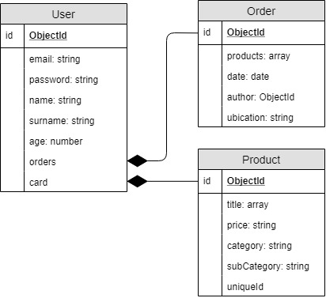

# MyBreak App

## Introductin
Allows to order food, choosing the place and products. At the end it generates a QR code
that the user can save and go with it to chosen place to pick up the order.

## Functional description
Guest can:
- Register an accout
- Log in with registered accout

Only user with a registered account can use app.

User can:
- Log in
- Make order
    - Select pick-up location
    - Select products
    - Pay
    - Save QR code
    - Log out

### Use cases

#### Guest 

#### User

### Flowcharts

#### User

## Technical  description

### Blocks

### Components

### React Components

### Data model

### Code Coverage
####  API logic

####  APP dataApi

####  APP logic

## Technologies

Javascript, ReactJS, Node.js, Express, MongoDB & Mongoose.

## Organization
trello
https://trello.com/b/zoQlSshC/mybreak

## To do list

Qr code scanner with laptop's camera

Modification of user account information

Improve coverage

Product punctuation