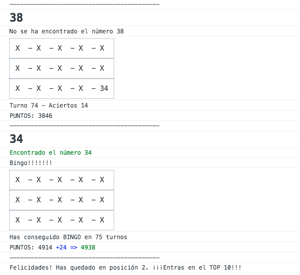

# Bingo

## Introduction
Realiza un programa que simule un Bingo. Cuando se ejecute, pedirá el nombre del jugador y deberá guardarse. Durante el primer turno se mostrará un cartón con 15 números (excluyendo el 0 siempre), para pasar al siguiente turno el usuario deberá confirmar mediante confirm() visualizándose otro número, si coincide con alguno de los existentes en el cartón, cambiará por una "X" o un 0. El cartón se mostrará, al final de cada turno, con los cambios efectuados, indicándole al usuario qué número se ha encontrado. El programa deberá preguntar al usuario al inicio de cada turno si desea continuar, en caso de que se continúe, seguirá el mismo patrón que hasta el momento.

Por supuesto, cuando todos los números de una misma linea estén en "X", mostrará un mensaje "LINEA!", pero la ejecución seguirá, el juego solo acabará cuando todos los números estén a "X".

Cuando el juego concluya, deberá decirle al usuario en cuantos turnos se ha completado el cartón. Por último, deberá preguntar si desea volver a jugar.

- Cuando se muestre la carta, se preguntará al usuario si realmente quiere ese cartón o generar otro, si realmente quiere ese cartón, deberá responder "yes" para proceder
- Establece un sistema de puntos, en cuantos más turnos se complete el cartón, menos puntos (el sistema de puntos intégralo como quieras), por el contrario, a menos turnos, más puntos.
- Antes de empezar el juego, muestra el sistema de puntos al usuario.
- Ranking de usuarios (ordenado por puntos).

___

## Functional description
El programa inicia la ejecución cuando se hace la llamada a la función de **skylabAirlinesMain()** esta función a su vez llama a todas las demás funciones. No se hace uso de clases y todo está programado por medio de funciones. 

Tampoco se hace uso de ningún otro archivo, todo el código se recoge bajo el archivo llamado "project2.js"

El programa se inicia mostrando los vuelos disponibles y preguntando al usuario si se trata de un ADMIN o de un USER. Cada Rol tiene una serie de opciones únicas. 

#### Imagen de cómo se muestran los vuelos en la consola

use cases diagram => https://es.wikipedia.org/wiki/Lenguaje_unificado_de_modelado

# Technical description

WorkFlow

