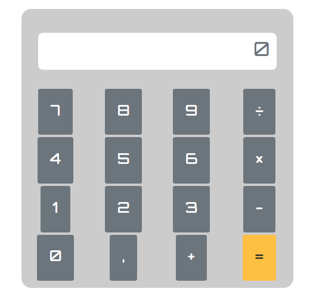

# Calculadora

## Introduction

Haz una calculadora. Un único programa al que le pasarás dos parámetros y el usuario podrá visualizar por consola la suma, resta, multiplicación y división entre ambos números. El resultado debería ser mostrado con 3 decimales como mucho (En caso de que hubieran). El programa debe contemplar y actuar correctamente en el caso de que el usuario introduzca cualquier cosa que no sean números.

- Si el usuario introduce un solo numero, deberá mostrar SOLO su raíz cuadrada, si vuelve a introducir los dos, volverá a mostrar las 4 operaciones de siempre.

- Los resultados deberían almacenarse dentro de una array y mostrarlos de una forma amigable al usuario.

- Después de hacer todas las operaciones, el programa deberá preguntar al usuario si desea volver a realizar otra operación, volviendo a almacenar más resultados y mostrándolos.

- Podrías hacer que le calculadora relizara operaciones sean cuales sean el numero de argumentos pasados a la funcion? Hint => https://developer.mozilla.org/en-US/docs/Web/JavaScript/Reference/Functions/arguments Hint => https://msdn.microsoft.com/es-es/library/he95z461

___

## Functional description
El programa se inicia al cargar el archivo index.html que contiene el html con los archivos js enlazados

# Technical description
WorkFlow
