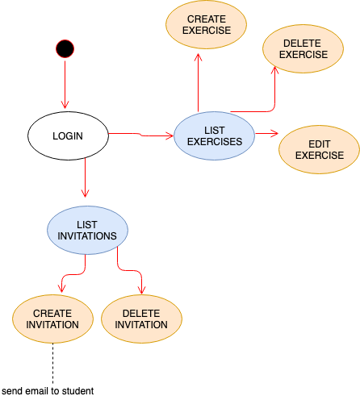

# STARTLAB APP

## Introduction
**Startlab** is an app to verify the minimum knowledge of Javascript required to start in the Skylab Academy. Also can be useful for any academy or teacher interested in create their own javascript exercises for their students.

**Startlab** app use Mocha to run the test created by the admin and check if the answer from the student is correct or not.

**Startlab** students needs an invitation to start the test.

### Use Cases

#### Flow Admin

#### Flow Student

## Technical Description

### Blocks - Client Side

### Blocks - Server Side

### Data Model

### Code Coverage

### Technologies

Client Side                |  Server Side
:-------------------------:|:-------------------------:
  |  
  |  
  |  
  |  

