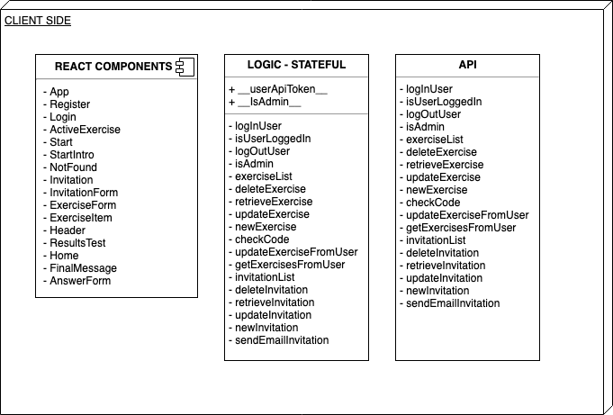

# STARTLAB APP

## Introduction
**Startlab** is an app to App to check the answer to javacript exercises from students

## Functional Description

### Use Cases

### Flows

#### Flow Admin

## Technical Description

### Blocks

### Components

### Data Model

### Code Coverage

### Technologies

