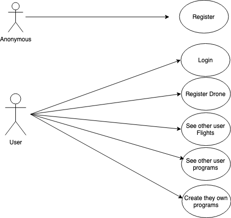
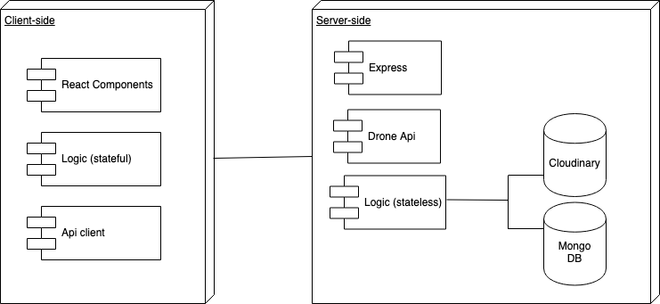
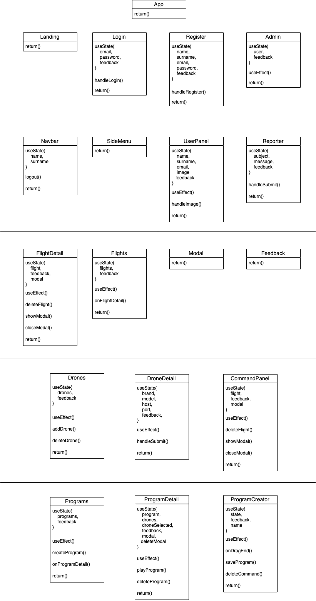
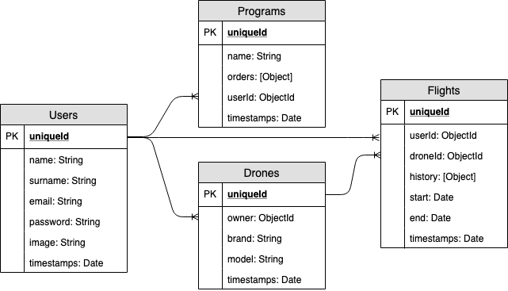
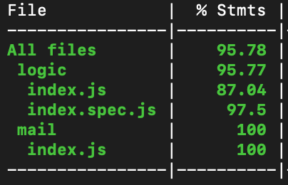
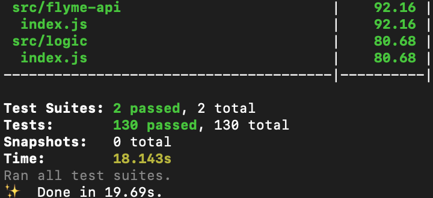

# Flyme app

## Introduction

Flyme is an application that allows the user to control a drone through the keyboard or also program a flight path to do it automatically.

Your system is designed to be very intuitive and can be used by everyone.

The application allows to learn the most basic notions on which the programming paradigms are based.

With Flyme you can enjoy from the youngest to the oldest.

## Functional description

Users can:

* Register an specific drone
* Control the drone with the keyboard
* See other user flights 
* See other user programs
* Create they own programs

Only registered users can access the platform's content.

### Use Cases

## Technical Description

### Blocks

### Components

### React Components

### Data Model

### Code Coverage

#### 

#### 

### Technologies
Javascript, ReactJS, Node.js, Express, MongoDB & Mongoose.