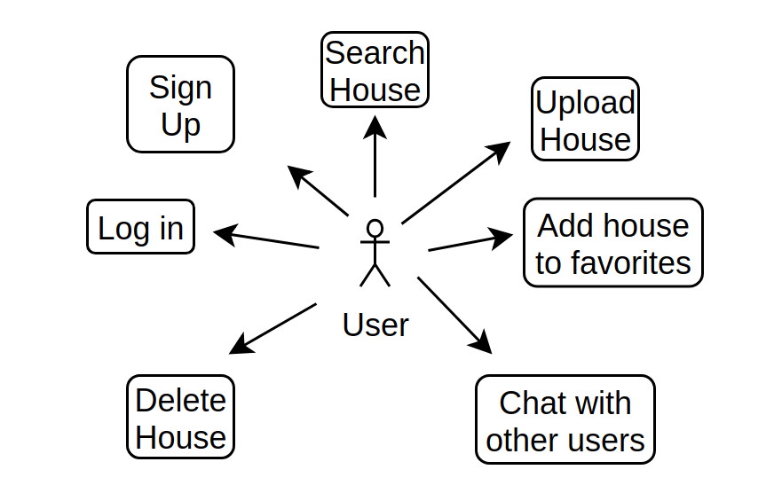
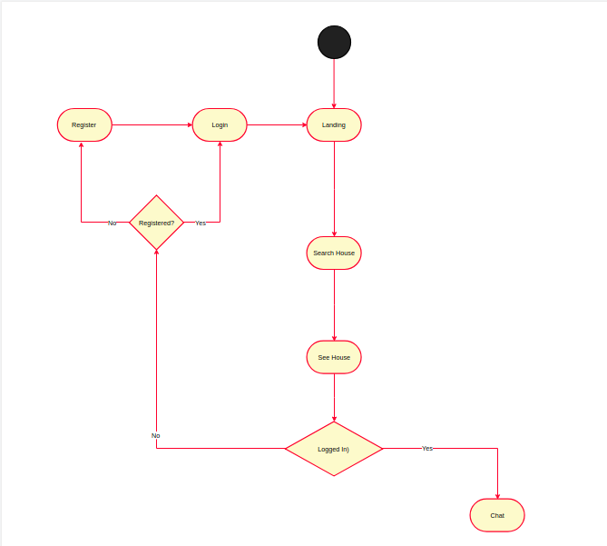
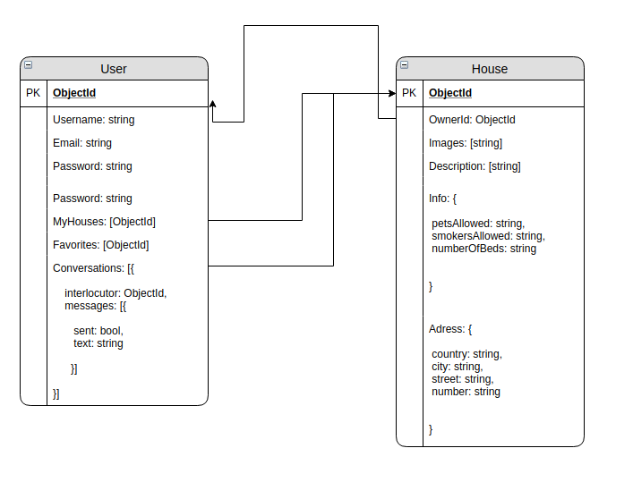
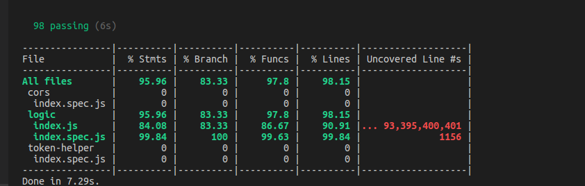
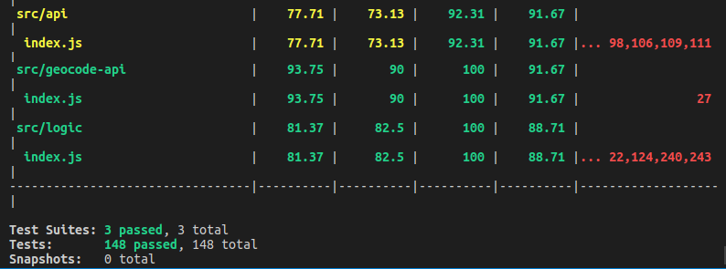

# HomeSwapp

## Introduction

HomeSwapp is a public platform to connect house owners from all over the world so they can swapp houses temporally.

## Functional description

Users can:

* Upload their houses.
* Search houses by City or Country.
* Save the houses they like in favorites.
* Chat with others users to exchange further information about the house and agree a temporal swapp.

### Use Cases

### Flowcharts

#### User

## Technical Description

### Blocks

### Components

### Data Model

## Code Coverage

#### API Coverage

#### APP Coverage

### Technologies
Javascript, ReactJS, Node.js, Express, MongoDB & Mongoose.

