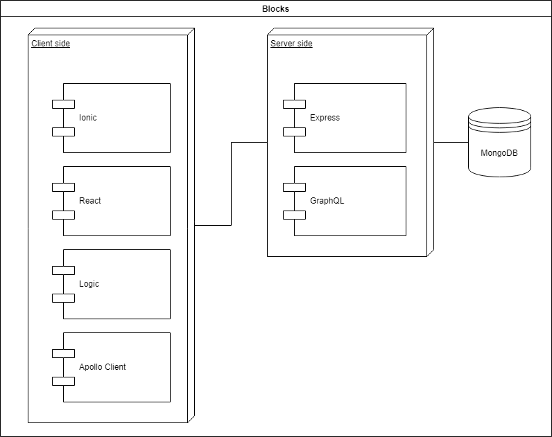
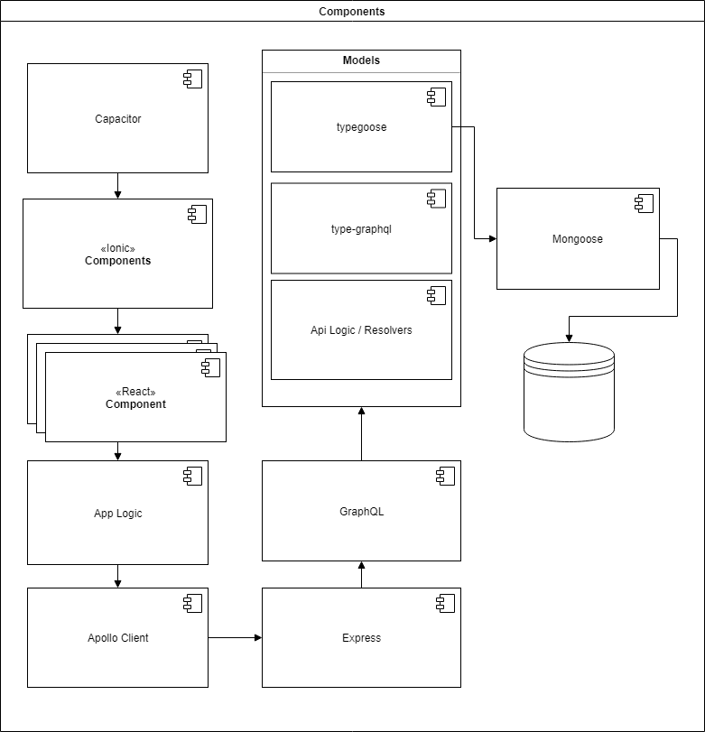
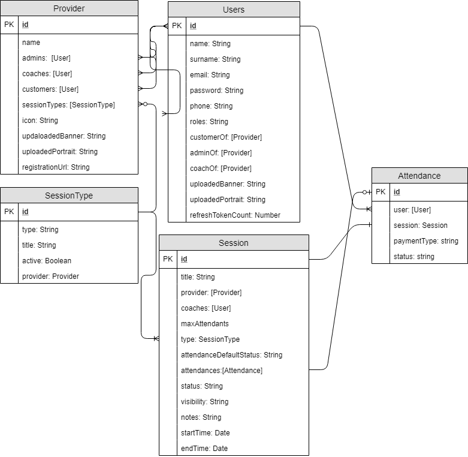
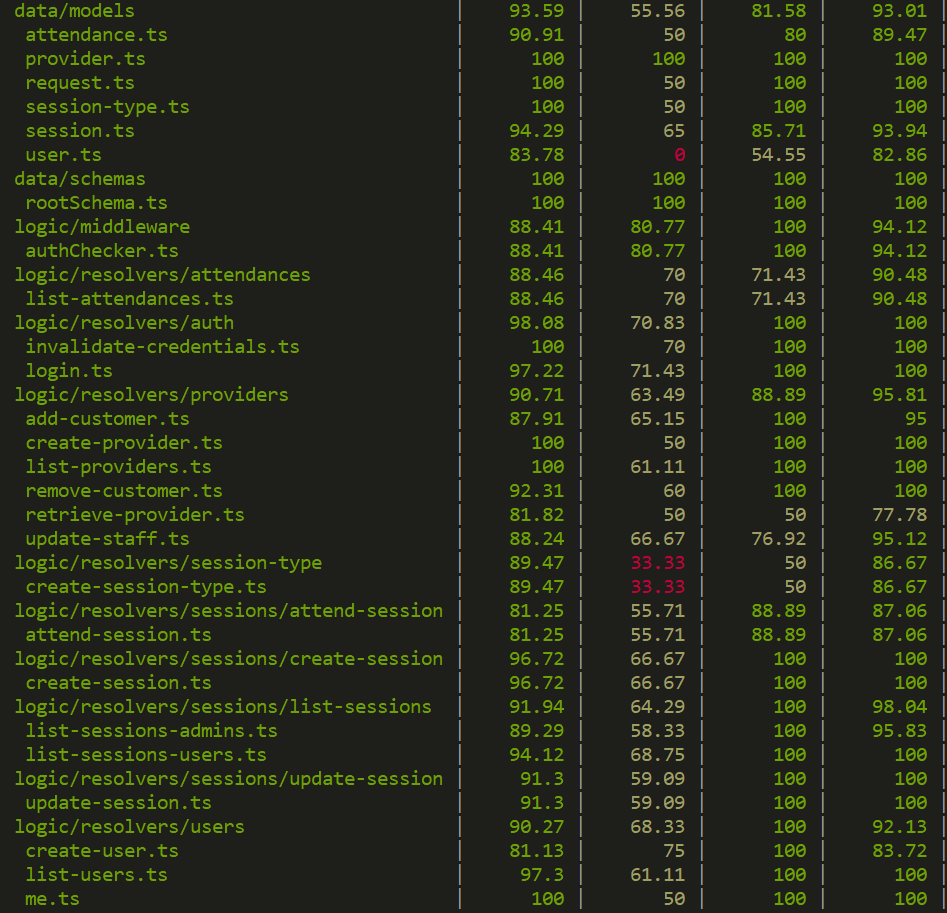

# StayFit

 

 
 
 
 
 
 
 
 
 
 

## Introduction

StayFit is a platform to make online appointments of personal trainer, group classes, workouts, events,...

## Functional description

Annonimous users can:

- Register
- Register with default provider
- Login

Logged users can:

- Send requests to providers to be customers
- View and book sessions with their providers for next 15 days
- View the details of next sessions but not the attendants
- View theirs previous attendances and payment details
- View their providers and brief profile

Admins of providers can:

- Accept or deny request to be customer
- Create, update and delete sessions
- View future sessions with the users that will attend
- Modify the payment status of each session and user
- Modify the status of the user appointment to cancel or approve the booking 

### Use cases

## Technical description

### Blocks

### Components

### Data model

### Code coverage

