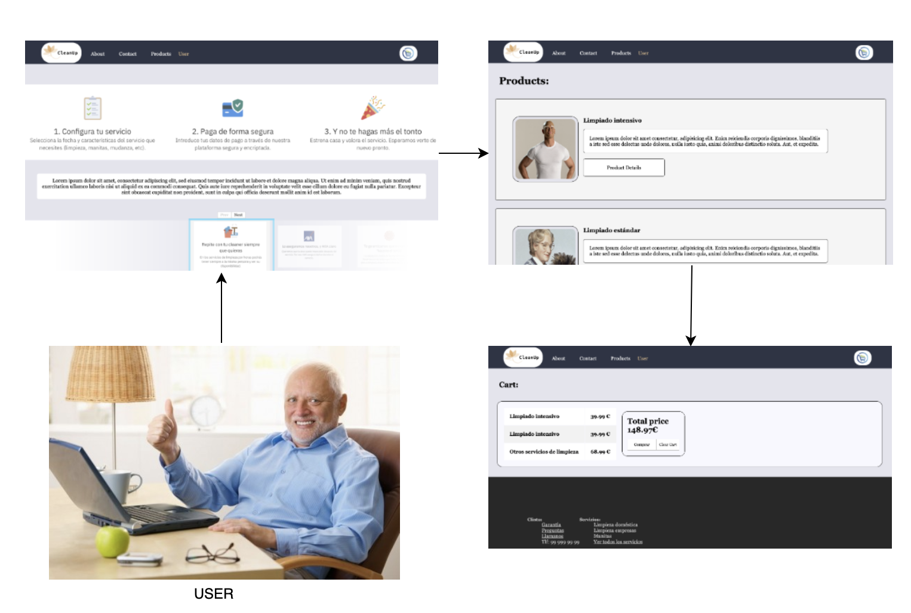
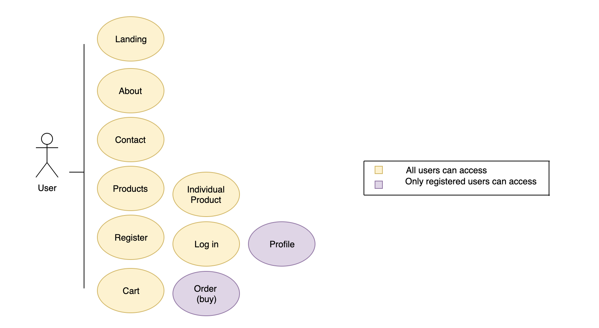
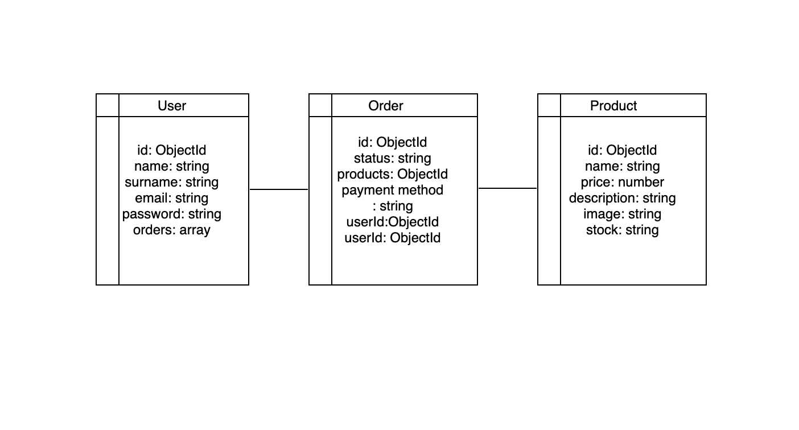
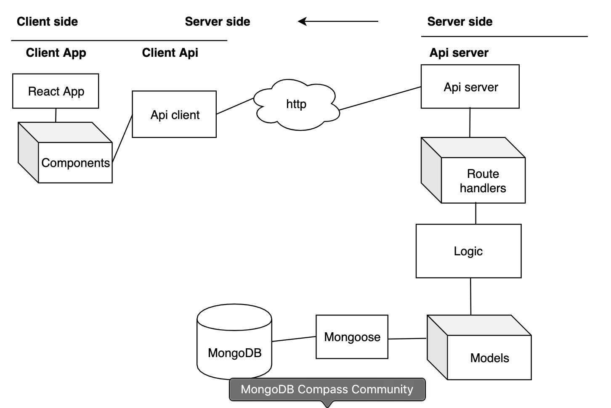
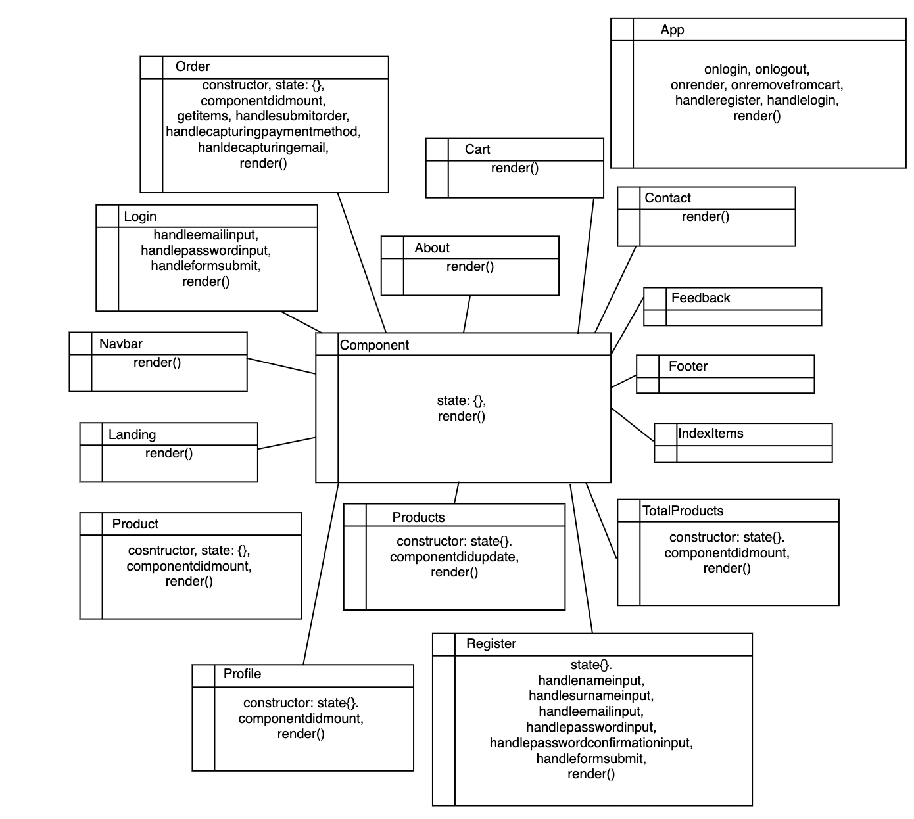

 CleanUp

===================================

## Documentation

[About me](https://github.com/PedroGarrigaNogues)

[Live Demo](http://cleanup.surge.sh/#/)

# Cleanup

# 

##About the tech:

To learn React, check out the [React documentation](https://reactjs.org/).

## TECHNOLOGIES

| Transversal | Server-side | Client-side | Testing |
| :---------: |:-------: |:----------: |:---------: |
| Agile Methodology|  Node.js | React | Mocha |
| javascript (ES5, ES6) | express.js | CSS | Chai |
| HTML | MongoDB, Mongoose  | Bootstrap | NYC (Istambul) |
 

### UML Diagram (User Cases)

The following picture describes the different ways in which the user can interact with our project:

## Technical description:

### DATA MODEL

In the diagram below we can see the schemas used, its properties and how are they interlinked in between each other. This structures were constructed prior to the server-side functional logic.      

### BLOCK MODEL

The project was built following this layer separation architechture:

### CLASS OBJECTS

In the diagram below we can see the components and some of their propieties.      

## PROJECT DEMO

You can see a demo of the project here: [surge](http://cleanup.surge.sh/#/)

