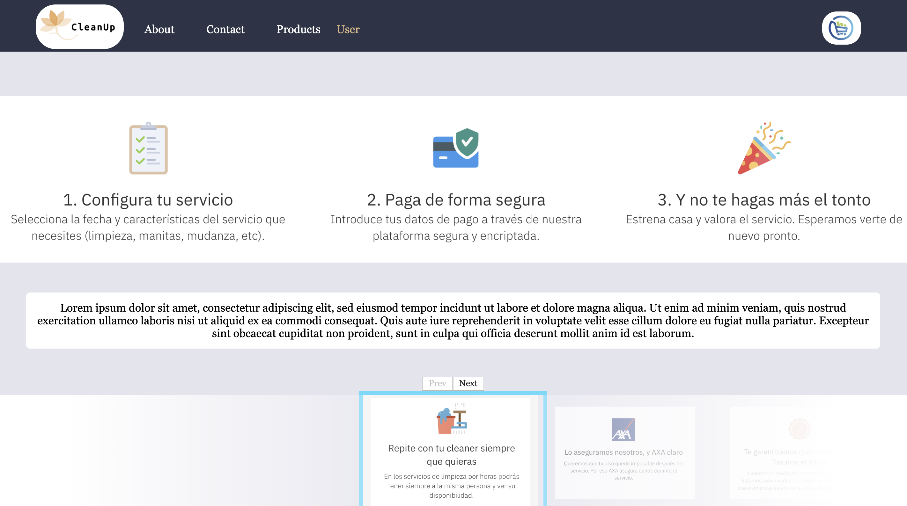

 CleanUp

===================================

## Documentation

[About me](https://github.com/PedroGarrigaNogues)

[Live Demo](http://cleanup.surge.sh/#/)

## Available scripts for development

In the project directory, you can run:

### npm start
Runs the app in the development mode.
Open http://localhost:3000 to view it in the browser.

The page will reload if you make edits.
You will also see any lint errors in the console.

### npm test
Launches the test runner in the interactive watch mode.
See the section about running tests for more information.

### npm run build
Builds the app for production to the build folder.
It correctly bundles React in production mode and optimizes the build for the best performance.

The build is minified and the filenames include the hashes.
Your app is ready to be deployed!

See the section about deployment for more information.

##About the tech:

To learn React, check out the [React documentation](https://reactjs.org/).

# SINGING-LAB

# 

## TECHNOLOGIES

| Transversal | Server-side | Client-side | Testing |
| :---------: |:-------: |:----------: |:---------: |
| Agile Methodology|  Node.js | React | Mocha |
| javascript (ES5, ES6) | express.js | CSS | Chai |
| HTML | MongoDB, Mongoose  | Bootstrap | NYC (Istambul) |

### UML Diagram (User Cases)

The following picture describes the different ways in which the user can interact with our project:

## Technical description:

### DATA MODEL

In the diagram below we can see the schemas used, its properties and how are they interlinked in between each other. This structures were constructed prior to the server-side functional logic.      

### BLOCK MODEL

The project was built following this layer separation architechture:

### CLASS OBJECTS

In the diagram below we can see the components and some of their propieties.      

## DESIGN (screenshots)

### Home Page

### Products

### Cart

## PROJECT DEMO

You can see a demo of the project here: [surge](http://cleanup.surge.sh/#/)

