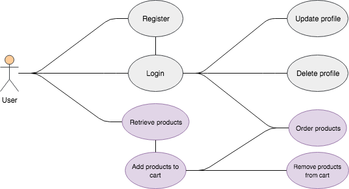
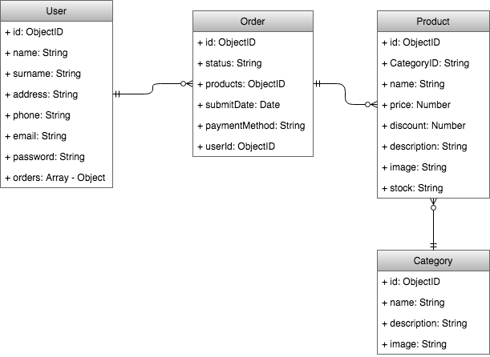
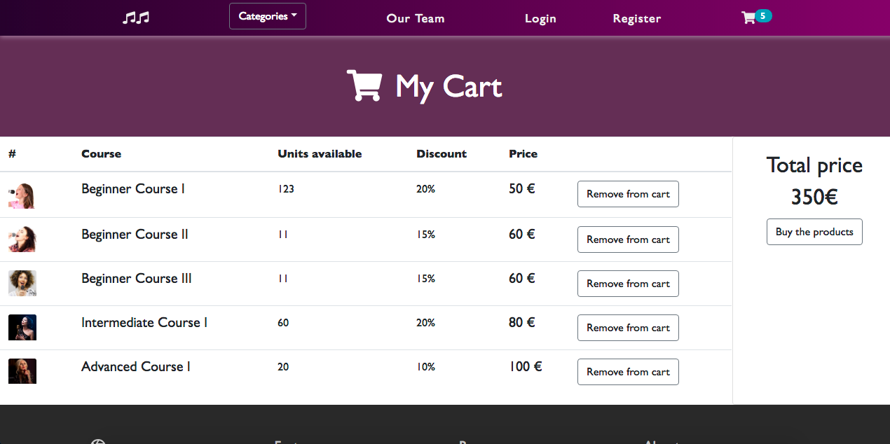
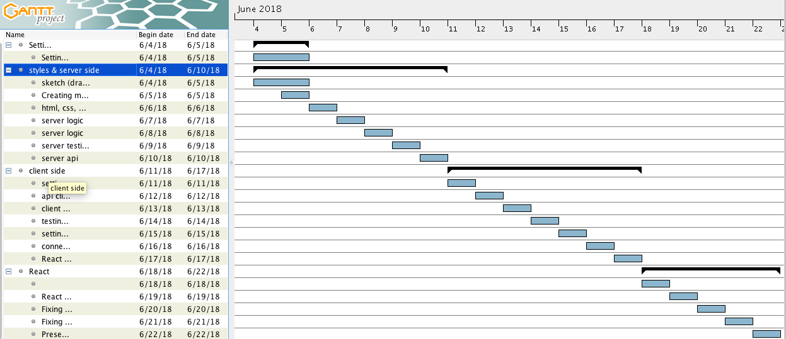

# SINGING-LAB

# 

## TARGET

This project is an [e-commerce](https://en.wikipedia.org/wiki/E-commerce) designed to sell online singing courses and products. Intended to bring and easy and comfortable way to purchase and improve your singing skills wherever you are and whenever you want to. 

## TECHNOLOGIES

| Transversal | Server-side | Client-side | Testing |
| :---------: |:-------: |:----------: |:---------: |
| Agile Methodology | Node.js | React | Mocha |
| javascript (ES5, ES6) | express.js | CSS3 | Chai |
| HTML | MongoDB, Mongoose  | Bootstrap | NYC (Istambul) |

- Other: [Trello](https://trello.com/b/eriWR8jg/final-project), Git & Github, surge, cloudinary, Draw.io. 

## Functional description:

In this application users can see an inventory of singing products classified in different categories/subcategories. Also, they can add the desired products into a cart and purchase them. Finally, in order to be able to execute the payment, users will have to be registered and logged first. 

### UML Diagram (User Cases)

The following picture describes the different ways in which the user can interact with our project:

## Technical description:

### DATA MODEL

In the diagram below we can see the schemas used, its properties and how are they interlinked in between each other. This structures were constructed prior to the server-side functional logic.      

### BLOCK MODEL

The project was built following this layer separation architechture:

## DESIGN (screenshots)

### Home Page

### Login

### Register

### Products

### Product details

### Cart

### Order

## PROJECT DEMO

You can see a demo of the project here: [surge](https://singing-lab.surge.sh/#/)

## Sprint Plan (Gantt Chart)

