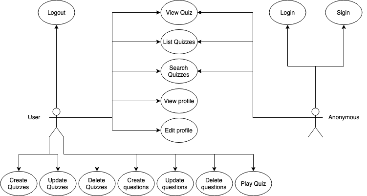
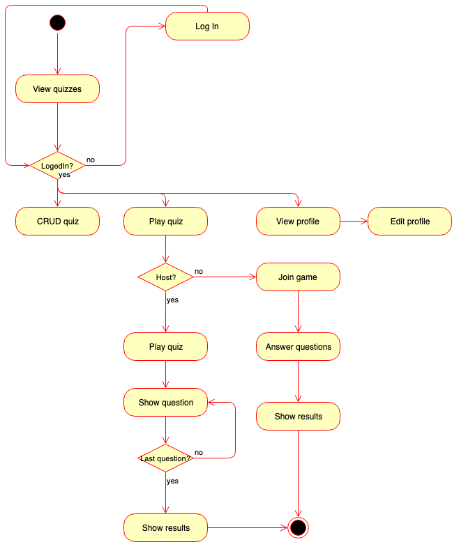
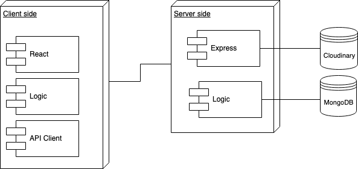
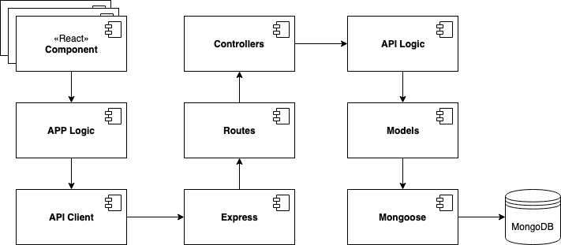
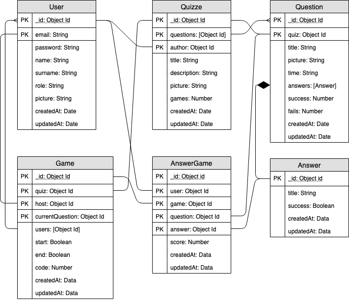
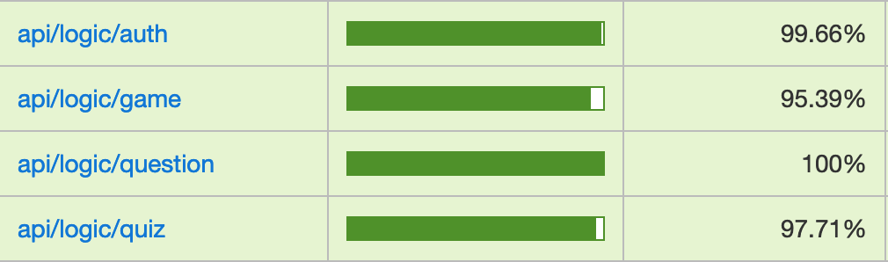
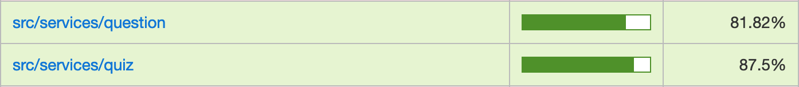
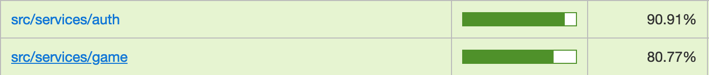
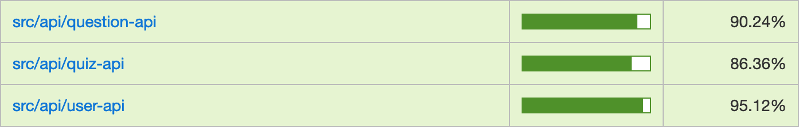
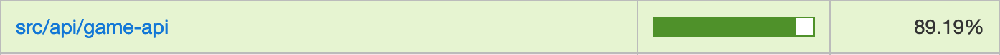

# TriviAPP

 
 
 
 

## Introduction

TriviAPP is a platform that enables the creation of test-type evaluation questionnaires so that users can play in real time.

Choose a questionnaire, start the game and wait for the users that have the code to join the game and start playing!

## Functional Description
Users can:

* Create and edit an evaluation questionnaire with its different questions and answers
* Check and/or edit their profile

* Play multi-player games in real time

### Use Cases

### Flows

## Technical Description

### Blocks

### Components

### Data Model

### Code Coverage

