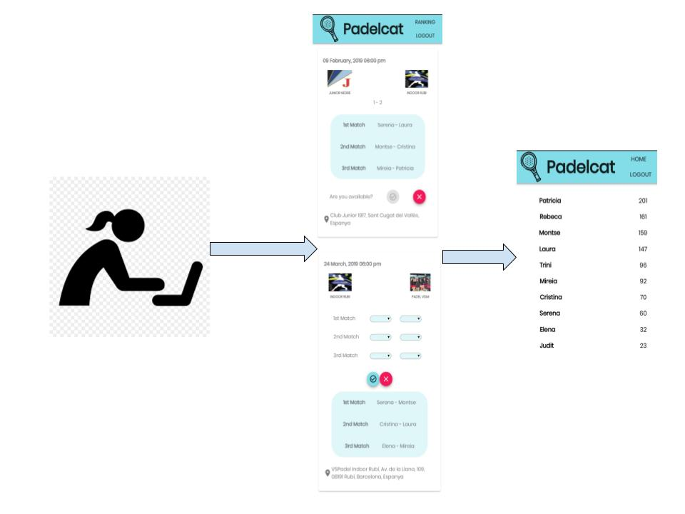
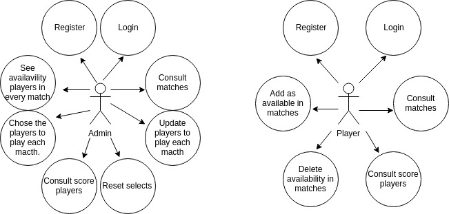
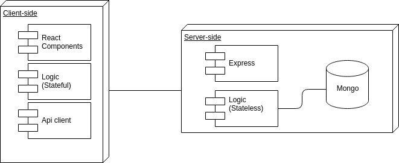
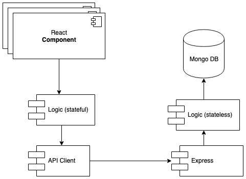
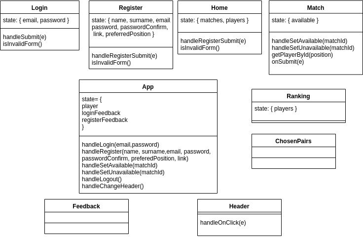
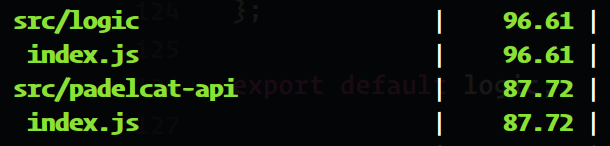
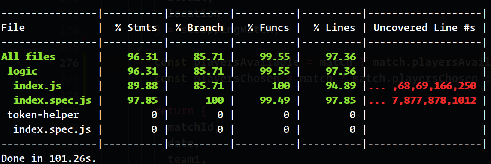

# Padelcat-app 
## Introduction

Padelcat-app is a tool created to manage a team that playes in padelcat league. 

With this app will be easy to control the availability of the players for every match and inform who are the chosen players.

Also in the app  the user can consult the score of any player, and all the data related with every match of the fase.

## Functional descrption

 ### Player: 
    - Consult the matches of the fase.
    - Add the availavility for every match.
    - Consult the score of the team.
    - Consult the data of the match.
    - Consult the players chose to play every match.
 ### Admin: 
    - Consult the matches of the fase.
    - Consult availability of players.
    - Consult the score of the team.
    - Consult the data of the match.
    - Chose the players of every match according the availavility that the players inform.
    - Consult the player chose to play a match.

## Use cases

## Technical description

### Blocks

### Components

### React Components

### Code Coverage

##### APP

##### API

## Technologies
Javascript, ReactJS, Node.js, Express, MongoDB & Mongoose.
