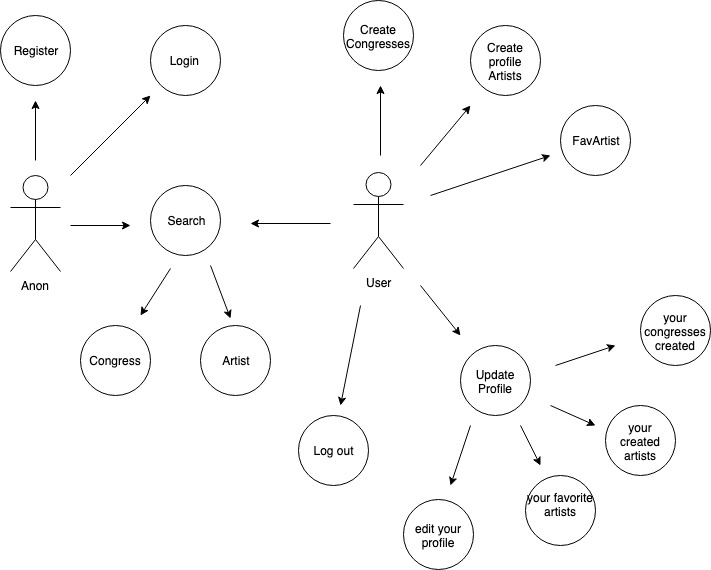
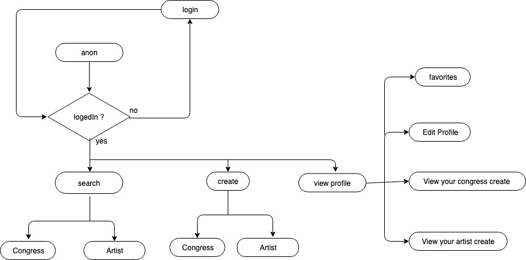
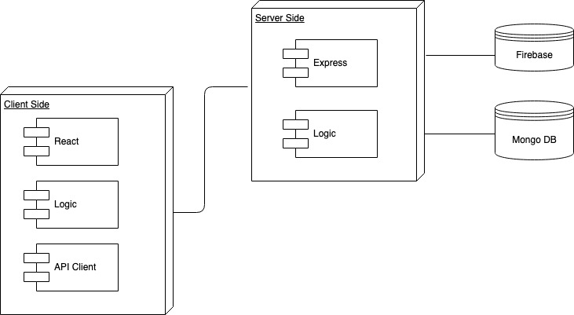
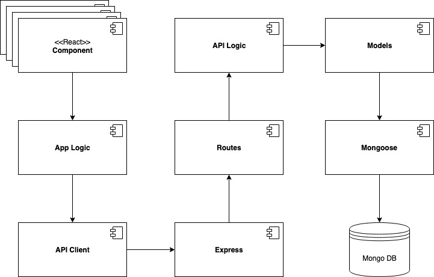
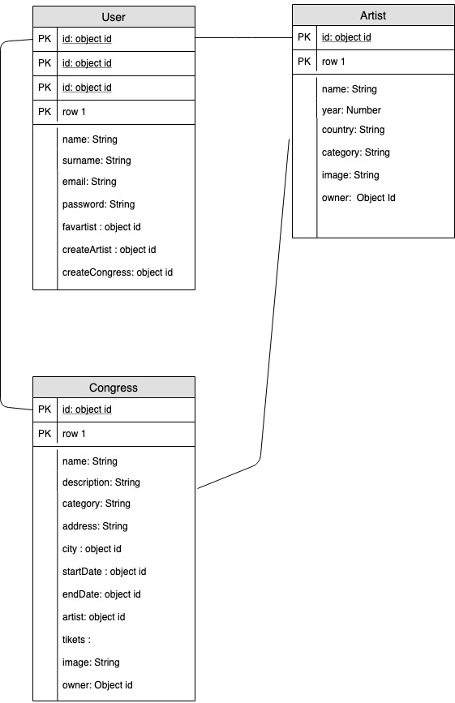

# laClave

## Introduction

**laclave** is an app related with the world of the social dancing. laclave is a searcher of salsa, bachata and mambo congresseses.

Also, in **laclave** you can find the best artist and knows when will be the next congress in your city.

### >>>> [Live demo](https://laclave-salsa.surge.sh/#/)

# Functional Description

Users can:

- Search for a congress or an artist **by name or city**
- Create a congress
- Create an artist
- See the details about any artist and congress
- Add to your favorites artists

## Use Cases

## Flows

# Technical Description

## Blocks

## Components

## Data Models

## Test Coverage

## Working  Progress

- Put Firebase logic in server side
- Allow users to buy a congress