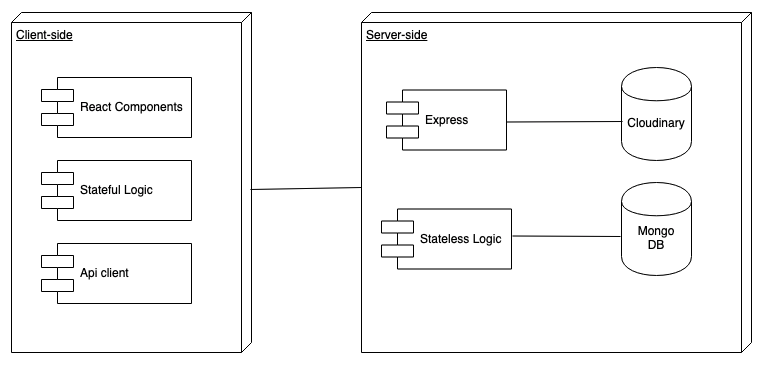

# Arshop app

arshop is a platform that allows users to sell second hand products.

## Description

arshop is an app where users can find second hand products and publish a product. The app's peculiarity is that you can see products on AR!
As a seller you have the option to upload a 3D model of your product, and as a buyer you have the option to see it on augmented reallity.

## Functional Description

User can: 

* Find second hand products
* Publish a product with an image and a 3D model
* See second hand products on Augmented Reality
* Check their products as sold
* Chat with other users

### Use Cases

## Technical Description

### Blocks

### Components

### Data Model

### Code Coverage

#### Coverage API

### Technologies
Javascript, ReactJS, Node.js, Express, MongoDB, Mongoose, AR js, A-frame