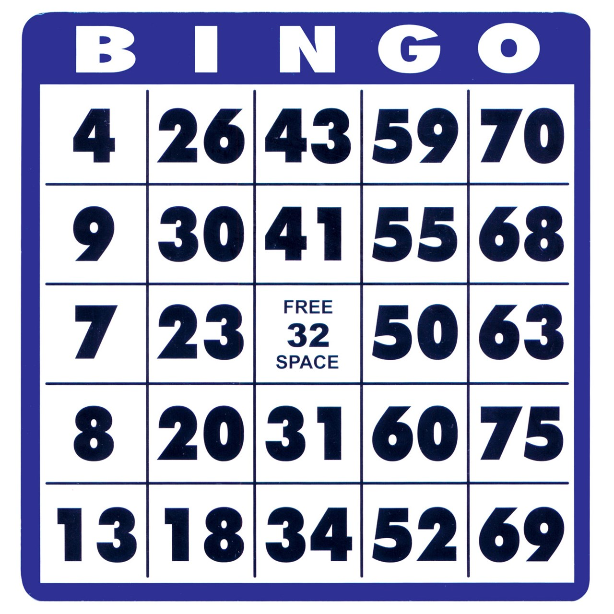

# Bingo



## Introduccion 

**Juego bingo de toda la vida !!**, tienes un carton con 15 numeros y a medida que vas jugando van saliendo numeros random. Si estos numeros coinciden con los que tienes en tu carton se tacharan (~~numero~~).
Cuando llegas a tachar todo el carton ganas la partida.

## Como funciona?

Basicamente  tu carton es un array de 15 numeros generados aleatoriamente. Cuando empiezas a jugar se va generando un nuevo y si coinciden se tacha.


Se generan con esta funcion:

```javascript
function GenerateNumRandomCarton(){
        numRandomcarton = Math.floor(Math.random()*(20)+1);
        return numRandomcarton; 
}
```
Al coincidir se pone una variable en **true** para qye no se vuelva a repetir ese numero.