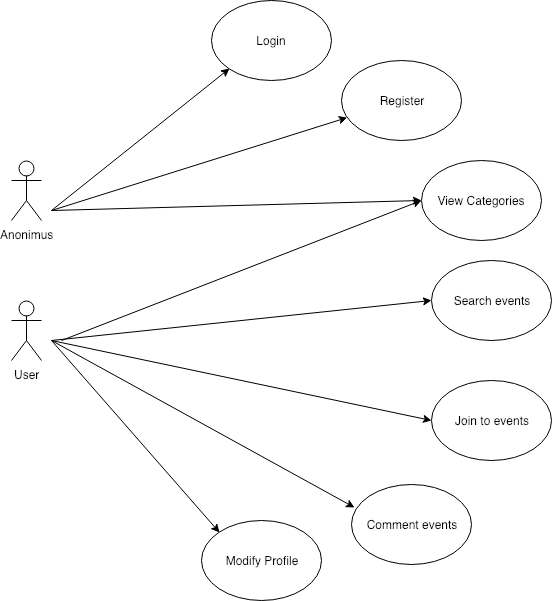
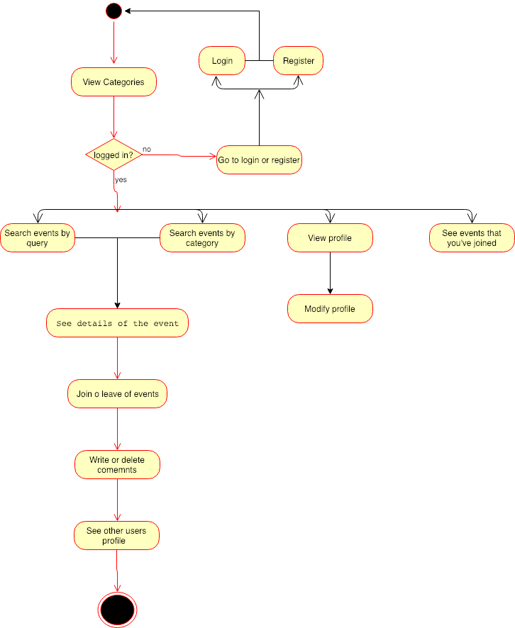
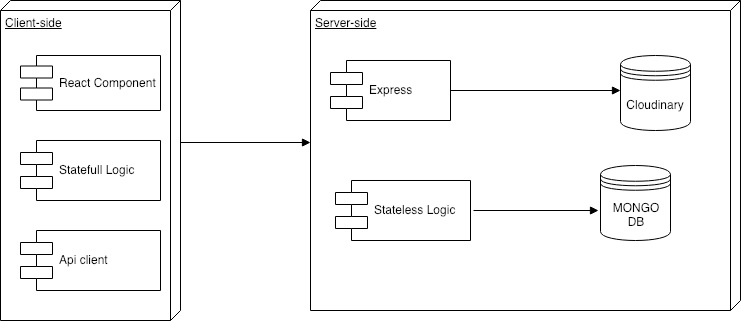
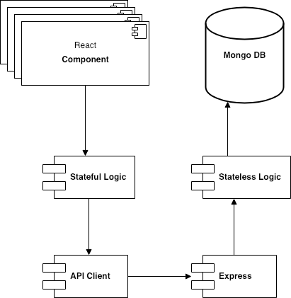
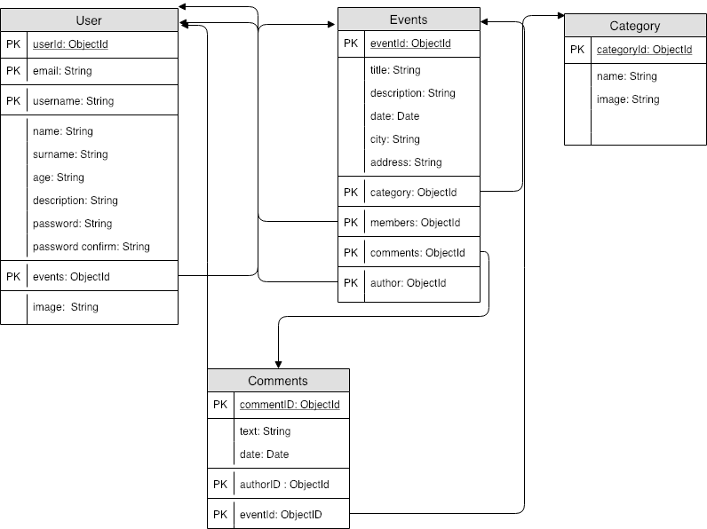
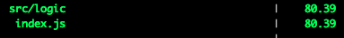
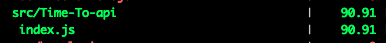
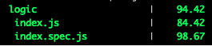

# TimeTo

## Description:

Creation of an event manager in which a user can both create and join events and comment on them.

## Funtional description:

The user can:

- Log in or register
- Create , search and join events.
- See your profile and modify it.
- See the profile of other users.
- Write and delete comments.

### Use Cases

### Flows

## Technical Description

### Blocks

### Components

### Data Models

## Coverage

### Client Side

### Server Side

## Technologies

SASS , REACT , MONGODB, MOONGOOSE, EXPRESS,NODE.JS,JAVASCRIPT,HTML5 ...

